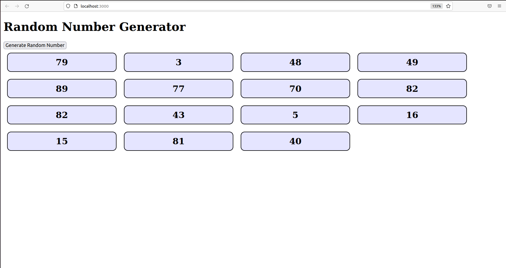

# React State 2: Random Numbers

Now let's put everything we have learned over the last week or so together to create a "mini-app" from scratch which generates random numbers!

## Instructions

1. You currently have an `App` component. Make sure it returns a `<h1>` JSX element containing the text "Random Number Generator".

2. Now create a `RandomNumber` component. For now, this should simply render a JSX div (you can add some light styling later). Later, this will display a random number to the user.

3. Next create a `RandomNumberList` component that renders a JSX div. Soon we will use this div to contain some `<RandomNumber />` components. Initialize one `<RandomNumberList />` component in your `App` component

4. Finally, create a `Button` component that renders a JSX button with the text "Generate Random Number". You should initialze one `<Button />` component at the top of your `App` component.

5. Create a `useState` **hook** in the `App` component. This should keep track of a variable called `randomNumbers`, which should be initialized to an **empty array** when creating your hook. 

6. When the user clicks the button, a random whole number between 1 and 100 should be added to the `randomNumbers` array. To do this, you should use the function you created while initializing your `useState` hook in `App` in **Part 5**.

7. Make sure that, with each re-render of your app, you create as many `<RandomNumber />` components inside the `RandomList` component as there are numbers in your `randomNumbers` array. Remember: using **.map()** could be a good way to achieve this!

**Hint:** Remember that to update the `randomNumbers` array, you **should not** try to `push` the new number!

**See below for how your app should look:**

- **A. On page load**
- **B. After clicking the button 15 times**

**Note:** The styling in the below images is less important - you can style your app to look good, but **only** if you have time **after** you have achieved the core functionality...

